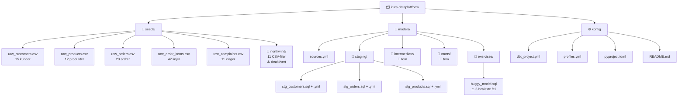

# Repo-oversikt

```mermaid
graph TD
    ROOT["🗂 kurs-dataplattform"]

    ROOT --> SEEDS["📁 seeds/"]
    ROOT --> MODELS["📁 models/"]
    ROOT --> CONFIG["⚙️ konfig"]

    SEEDS --> S1["raw_customers.csv\n15 kunder"]
    SEEDS --> S2["raw_products.csv\n12 produkter"]
    SEEDS --> S3["raw_orders.csv\n20 ordrer"]
    SEEDS --> S4["raw_order_items.csv\n42 linjer"]
    SEEDS --> S5["raw_complaints.csv\n11 klager"]
    SEEDS --> NW["📁 northwind/\n11 CSV-filer\n⚠️ deaktivert"]

    MODELS --> SRC["sources.yml"]
    MODELS --> STG["📁 staging/"]
    MODELS --> INT["📁 intermediate/\n🚧 tom"]
    MODELS --> MAR["📁 marts/\n🚧 tom"]
    MODELS --> EX["📁 exercises/"]

    STG --> STG1["stg_customers.sql + .yml"]
    STG --> STG2["stg_orders.sql + .yml"]
    STG --> STG3["stg_products.sql + .yml"]

    EX --> BUG["buggy_model.sql\n⚠️ 3 bevisste feil"]

    CONFIG --> CFG1["dbt_project.yml"]
    CONFIG --> CFG2["profiles.yml"]
    CONFIG --> CFG3["pyproject.toml"]
    CONFIG --> CFG4["README.md"]
```
